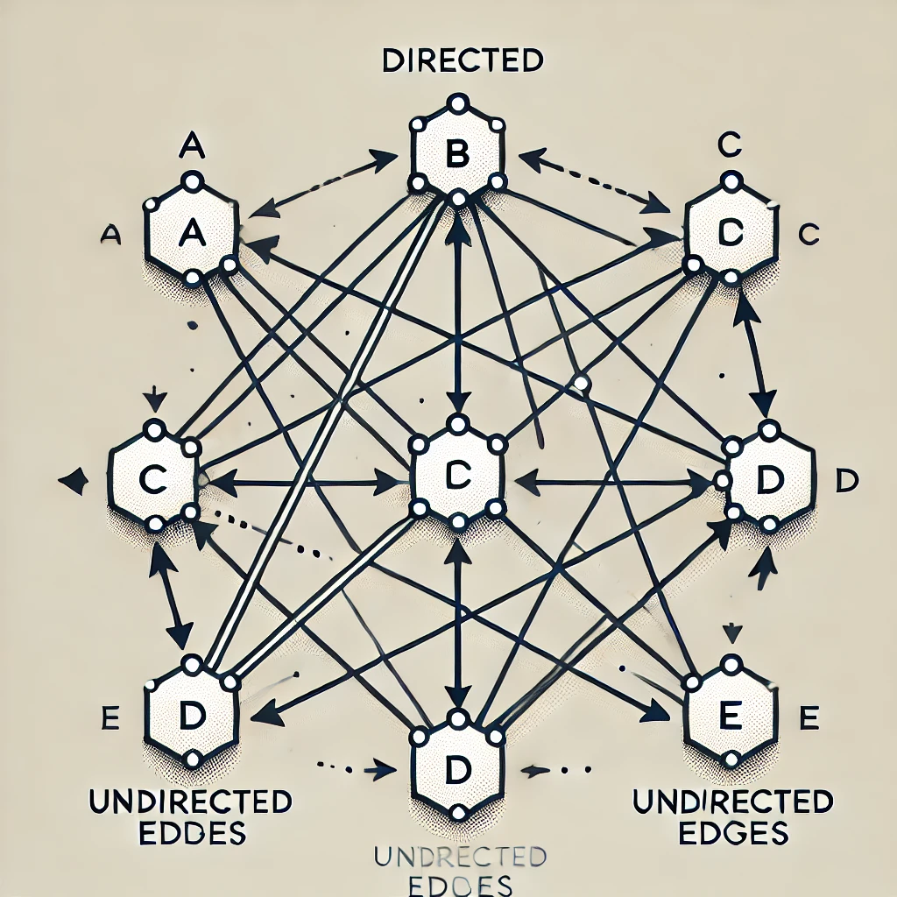
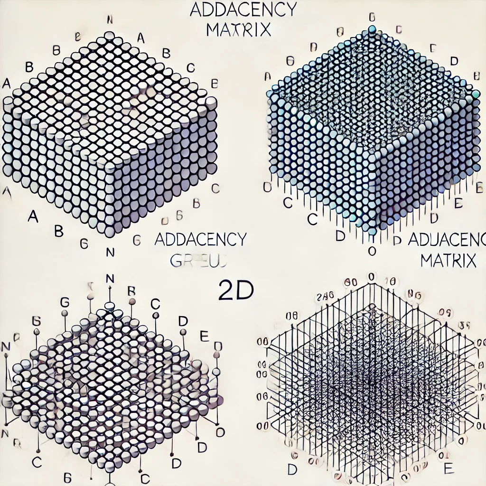
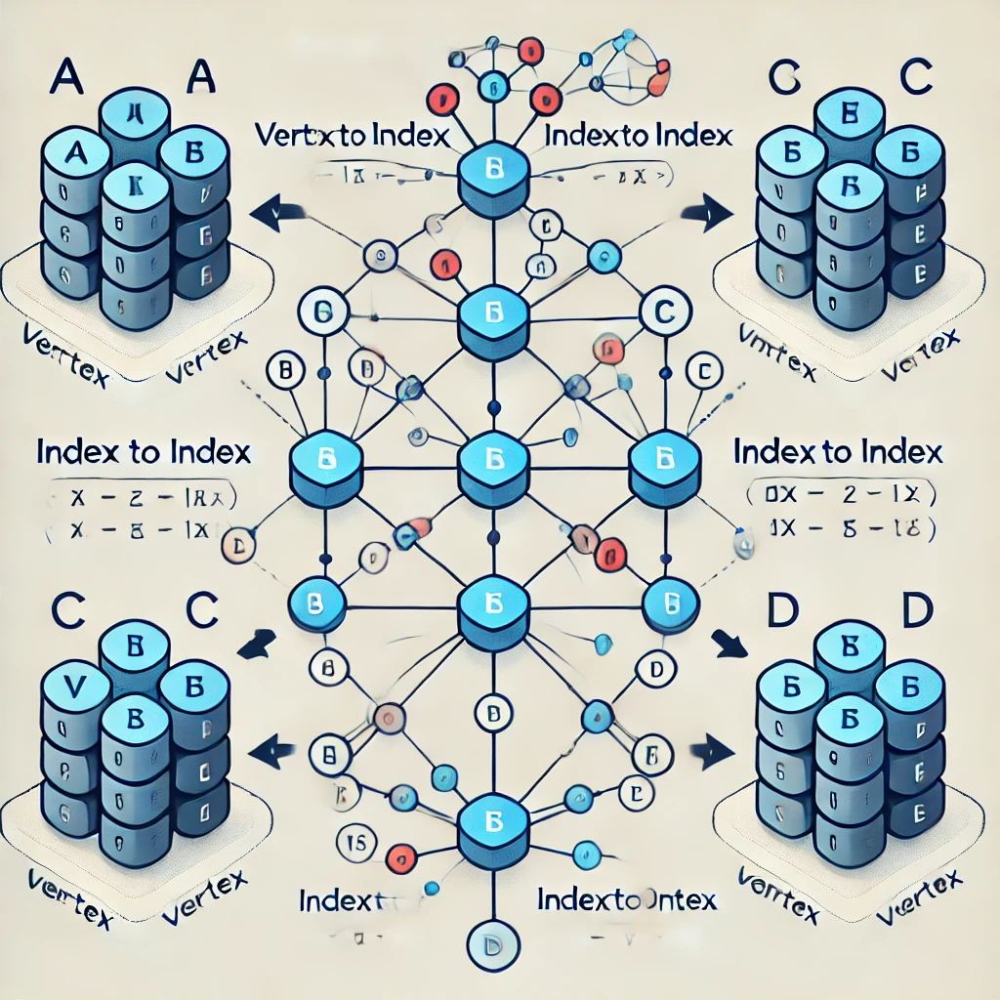

📌 Overview

GraphMatrix.h is a header file that defines the GraphMatrix class, which represents a graph using an adjacency matrix. This data structure is useful for graph-related operations such as:

Adding and removing vertices and edges
Retrieving connectivity information
Efficient traversal and manipulation of graph data
🔹 Key Features

Adjacency Matrix Representation: Uses a 1D matrix flattened as a 2D matrix to store edges.
Supports Weighted and Unweighted Graphs: Can handle edge weights efficiently.
Template-based Design: Allows customization of vertex and edge types.
📌 Structure of GraphMatrix.h

🔹 Templates Used: 
template <typename VertexType, typename EdgeType>
class GraphMatrix {}

VertexType: Represents the type of vertices (e.g., int, std::string).
EdgeType: Represents the type of edge weights (int, double, etc.).

template <typename VertexType, typename EdgeType>
class GraphMatrix {
private:
    std::map<VertexType, size_t> vertexToIndex;
    std::vector<VertexType> indexToVertex;
    std::vector<std::optional<EdgeInfo<EdgeType>>> adjacencyMatrix;
    size_t numVertices = 0;
    bool isDirected;
    bool isWeighted;
public:
    void addVertex(const VertexType& vertex);
    void addEdge(const VertexType& src, const VertexType& dest, EdgeType weight);
    bool hasEdge(const VertexType& src, const VertexType& dest);
    EdgeType getEdgeValue(const VertexType& src, const VertexType& dest);
    std::vector<VertexType> getNeighbors(const VertexType& vertex);
    ...
};

🔹 Important Components

1. adjacencyMatrix
The adjacencyMatrix is a 1-Dimensional vector that is viewed as a 2-Dimensional matrix by using a formula to calculate offsets for storing values. Each element in the matrix is a std::optional containing an EdgeInfo struct or std::nullopt if no edge exists between the vertices.

Representation: A 1D vector viewed as a 2D adjacency matrix.
Data Type: std::optional<EdgeInfo<EdgeType>>
Purpose: Stores edges efficiently using index-based access.
To convert 2D indices (i, j) into a 1D index, a helper function is used:
inline size_t getIndex(size_t i, size_t j) const {
    return i * numVertices + j;
}

This allows flattening and efficient memory access.

Visual Representation of adjacencyMatrix:

1D Representation:
[ 0,  5, ∞, 10,  ∞, ∞, 2,  ∞, 7 ]

Flattened into a 2D Matrix (numVertices × numVertices):
   A   B   C  
A [ 0   5   ∞ ]  
B [ 10  ∞   ∞ ]  
C [ 2   ∞   7 ]  

Efficiently stores edge weights
Fast index-based access
2. numVertices
This variable stores the current count of vertices in the graph.

3. isDirected and isWeighted
isDirected: true if the graph is directed.
isWeighted: true if the graph has weighted edges.
4. vertexToIndex
This std::map maps each vertex to its corresponding index for fast lookups.

5. indexToVertex
This std::vector maps each index to the corresponding vertex in the order they were inserted.

How are indexToVertex and vertexToIndex related?

Consider a graph starting with an empty state. When you add a vertex "A", it is first added to the last index of indexToVertex. For this example, "A" would be at index 0. In vertexToIndex, the vertex "A" maps to index 0.

📌 How GraphMatrix.h Works

Adding a Vertex
Assigns an index to the vertex and expands the adjacency matrix to accommodate new vertex connections.
Adding an Edge
Converts vertex names into numeric indices using vertexToIndex, then stores the edge weight in the adjacency matrix using getIndex(i, j).
Retrieving Neighbors
Uses the adjacency matrix to check which indices contain non-null values and converts numeric indices back to vertex names using indexToVertex.

📌 Connections to Other Files

MixedGraph.h → Extends GraphMatrix.h to support mixed graphs.
GraphAlgorithms.h → Implements BFS, DFS, Shortest Path, etc.

📌 Visual Representations
1. Simple graph with mixed directed and undirected edges

2. Adjacency Matrix Representation (1D to 2D conversion):

3. Vertex Mapping (vertexToIndex and indexToVertex):

4. Flattening a 1D Vector into 2D using getIndex function:

📌 Available Methods:

void addVertex(const VertexType& vertex);
void addEdge(const VertexType& src, const VertexType& dest, EdgeType weight);
bool hasEdge(const VertexType& src, const VertexType& dest);
EdgeType getEdgeValue(const VertexType& src, const VertexType& dest);
std::vector<VertexType> getNeighbors(const VertexType& vertex);
