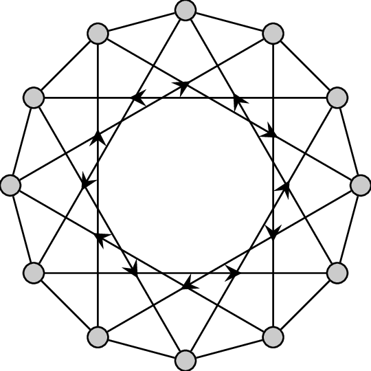

**📌 Overview**

MixedGraph.h extends GraphMatrix.h to represent mixed graphs, which contain both directed and undirected edges.

🔹 Key Features:
Supports Mixed Graphs: Can handle both directed and undirected edges.
Template-Based Design: Allows flexible customization of vertex and edge types.
Degree Calculation Functions: Provides methods for in-degree, out-degree, and total degree calculations.

**📌 Structure of MixedGraph.h**

🔹 Templates Used:
template <typename VertexType, typename EdgeType>
class MixedGraphMatrix : public GraphMatrix<VertexType, EdgeType>

VertexType: Represents the type of vertices.
EdgeType: Represents the type of edge weights.

🔹 Class Definition
template <typename VertexType, typename EdgeType>
class MixedGraphMatrix : public GraphMatrix<VertexType, EdgeType> {
public:
    void addEdge(const VertexType& src, const VertexType& dest, EdgeType weight, bool isDirected);
    int getTotalDegree(const VertexType& vertex);
    int getInDegree(const VertexType& vertex);
    int getOutDegree(const VertexType& vertex);
};

🔹 Important Components
Component	      Description
adjacencyMatrix	  A 2D vector inherited from GraphMatrix, storing both directed and undirected edges.
vertexToIndex	  Maps a vertex to its corresponding index.
indexToVertex	  Maps an index back to a vertex.

📌 How MixedGraph.h Works

Adding a Directed Edge:
Updates the adjacency matrix only for src -> dest.

Adding an Undirected Edge:
Updates the adjacency matrix for src -> dest and dest -> src.

Degree Calculation:
getInDegree(): Counts incoming edges.
getOutDegree(): Counts outgoing edges.
getTotalDegree(): Sum of in-degree and out-degree.

📌 Connections to Other Files

🔹 Dependencies
GraphMatrix.h: Provides the adjacency matrix structure.
GraphAlgorithms.h: Uses MixedGraph.h for algorithmic implementations.

🔹 Interaction with Other Components
MixedGraph.h extends GraphMatrix.h, enabling more functionality while reusing core graph storage mechanisms.

📌 Visual Representation

🔹 Mixed Graph Adjacency Matrix

🔹 Vertex Mapping

📌 Available Methods
void addEdge(const VertexType& src, const VertexType& dest, EdgeType weight, bool isDirected);
int getTotalDegree(const VertexType& vertex);
int getInDegree(const VertexType& vertex);
int getOutDegree(const VertexType& vertex);
