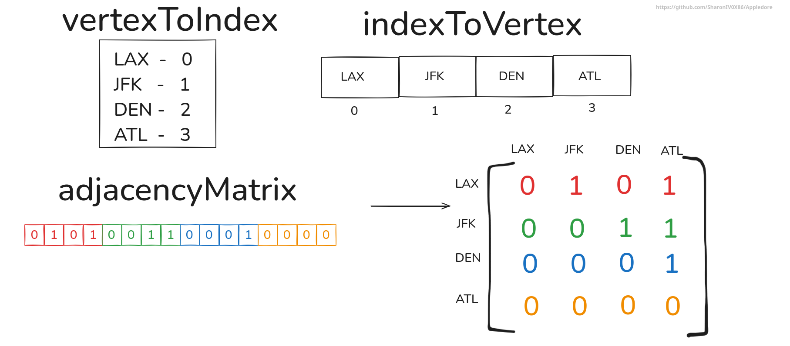

# Components of GraphMatrix.hpp
1. [Include directives](#1-include-directives)
2. [struct EdgeInfo](#2-struct-edgeinfo)
3. [class GraphMatrix](#3-class-graphmatrix)
4. [Tag structures](#4-tag-structures)
5. [External dependencies](#)

# 1. Include directives
```cpp
#include <functional>
#include <vector>
#include <iostream>
#include <stdexcept>
#include <optional>
#include <map>
#include <stack>
#include <algorithm>
#include <set>
```
These are the basic STL library included and used.

# 2. ``struct EdgeInfo``
```cpp
template <typename EdgeType>
struct EdgeInfo {
    EdgeType value;
    // Additional members can be added as needed
};

```
The templated ``EdgeInfo`` struct serves as the foundational element within the ``adjacencyMatrix`` of the ``GraphMatrix`` class. Each instance of ``EdgeInfo`` represents an edge between two vertices, with the value member storing the edge information of type ``EdgeType``.

This design offers flexibility, allowing additional attributes or metadata about an edge to be incorporated in the future, making it more adaptable for various graph-related use cases.

# 3. ``class GraphMatrix``
This is the main area of interest. The class ``GraphMatrix`` has a few methods which can be used to construct a graph. But how it works internally is more important.
The 4 main components of the ``GraphMatrix`` class are as follows:

## 3.1. **adjacencyMatrix**
The ``adjacencyMatrix`` is a one-dimensional vector designed to behave like a two-dimensional vector by employing a formula to calculate offsets for value storage.

- Each element in the adjacencyMatrix is of type ``std::optional<EdgeInfo>``.
- This means an element can either store an EdgeInfo object (representing an edge) or be std::nullopt (indicating no edge exists).

This structure provides flexibility and optimizes memory usage when representing sparse graphs, However ``GraphMatrix`` should be preffered for graphs in which vertex removals and additions are NOT so frequent.


## 3.2. **vertexToIndex** 
This mapping, implemented as a ``std::map``, associates each vertex with its corresponding index. This allows for efficient and fast lookups.

## 3.3. **indexToVertex**  
This mapping maintains the order of vertices as they are inserted, associating each index with its respective vertex.


## 3.4. **``numVertices``**
This private member variable keeps track of the number of vertices currently present in the graph. This variable can only be used by class methods.

**Caution**: During development make sure that you don't accidentally update the value stored inside the ``numVertices`` variable. This variable plays an essential part to calculate indices for ``adjacencyMatrix``.

## 3.5. ``isDirected`` and ``isWeighted``
Both of these private variables determine the characteristics of the graph:
- isDirected: Indicates whether the graph is directed.
- isWeighted: Indicates whether the graph has weighted edges.

**Caution**: During development make sure that you don't accidentally update the value stored inside ``isDirected`` and ``isWeighted``.

## 3.6. Relationship Between indexToVertex and vertexToIndex
Here's how these mappings work together:

1. **Starting Point**: Consider an empty graph.
2. **Adding a Vertex**: When a vertex (e.g., "A") is added:
    - It is assigned the last available index in indexToVertex.
    - For example, "A" is saved at the 0th index in indexToVertex.
    - Simultaneously, the vertexToIndex map associates the vertex "A" with its index (0 in this case).

This bidirectional relationship simplifies the process of looking up vertices or their indices efficiently.

# 4. Tag structures
Tag structures are used to define the properties of graphs, helping users specify various characteristics such as directionality and weight. In the ``GraphMatrix.hpp`` class, the following tag structures are defined in the MatrixRep.hpp file.

## 4.1 struct ``DirectedG``
```cpp
    struct DirectedG{}
```
This tag structure is used to indicate that the graph being created is directed, meaning that the graph's edges have a specific direction. It should be passed as a type parameter when constructing the graph.

## 4.2 struct ``UndirectedG``
```cpp
    struct UndirectedG{}
```

The ``UndirectedG`` tag structure is used to signify that the graph being created is undirected, meaning that the edges between nodes do not have a direction. This tag is also passed as a type parameter when constructing the graph.

## 4.3 struct ``UnweightedG``
```cpp
    struct UnweightedG{}
```
The ``UnweightedG`` tag structure is used to define that the graph is unweighted, meaning that the edges of the graph do not carry any associated weights. It should be used as a type parameter to indicate this property.

## 4.4. Usage in ``GraphMatrix`` Constructor
The ``DirectedG`` and ``UndirectedG`` structures are essential for determining the graph's properties within the ``GraphMatrix`` class. Specifically, the constructor uses these tag structures to determine whether the graph is directed or undirected, as well as whether it is weighted:
```cpp
GraphMatrix()
    : isDirected(std::is_same_v<Direction, DirectedG>),
      isWeighted(!std::is_same_v<EdgeType, UnweightedG>) {}
```
- ``isDirected``: Set to ``true`` if the graph is directed (i.e., if Direction is DirectedG).
- ``isWeighted``: Set to ``true`` if the graph is weighted (i.e., if EdgeType is not UnweightedG).

# 5. External Dependencies.
The **Appledore** library currently does not rely on any external third-party libraries. However, it does have internal dependencies that must be included for proper functionality.
## 5.1 ``MatrixRep.hpp``
The ``GraphMatrix`` class inherits publicly from the ``MatrixRepresentation`` class, which is defined in the ``MatrixRep.hpp`` file. This header file contains the necessary definitions for the ``GraphMatrix`` class to function correctly, and must be included for successful compilation.

## 5.2 Tag structures
The tag structures, which are explained in [Section 4: Tag Structures](#4-tag-structures), are also defined within the ``MatrixRep.hpp`` file. Including this file is essential for the compilation of the ``GraphMatrix.hpp``, as the tag structures play a key role in determining the properties of the graph.

# 6. Visual Example: Working of the Components in GraphMatrix
For this tutorial we will be considering one of the already existing example. This whole tutorial is based upon [this example](https://github.com/SharonIV0x86/Appledore/?tab=readme-ov-file#directed-weighted-graph-using-custom-structuresclasses). So, make sure you closely have a look at this code.

This tutorial will highlight the graph storage and will give you information about how does edge storage works internally in the **Appledore** library.

Before moving onto creating our graph, we will make some assumptions about some of the components.
## 6.1. Initial state of the containers
#### Structure of ``adjacencyMatrix`` container explained in [Section 3.1: adjacencyMatrix](#31-adjacencymatrix)


### The initial states of the all 3 containers are shown in the below image.


#### Assuming we have only just created the vertices and added them into our graph, but we have not made any connections yet. Initially all entries in ``adjacencyMatrix`` are 0s indicating no connections between any vertices. 
## 6.2. Key Obeservations
- The ``vertexToIndex`` maps each vertex to the index they are stored at in the ``indexToVertex`` vector.
- The ``indexToVertex`` maps each index with a vertex.
- Both ``vertexToIndex`` and ``indexToVertex`` contains vertices in the order they are inserted. For example, ``LAX`` was inserted first then ``JFK`` then ``DEN`` and so on.
- The ``adjacencyMatrix`` is a 1-dimensional vector containing (``numVertices`` * ``numVertices``) elements. But the 1-dimensional vector is being viewed as 2-dimensional by a simple formula. See [``getIndex``](https://github.com/SharonIV0x86/Appledore/blob/8d7dcd49843faf34e03a69f04c4bf2230dc86e48/include/GraphMatrix.hpp#L634) method in ``GraphMatrix`` class for more details.

### Now, Considering we want to build this graph. And we have made all the connections 

### The new state of all 3 containers will be as follows.

#### After making all the connections the new state of the containers. The ``adjacencyMatrix`` is updated to represent the above graph relationship.

## 6.3. Memory Representation of GraphMatrix
#### Below diagram will tell you about what will actually be contained at each element in the ``adjacencyMatrix``


## 6.3. Key Observations
- Each element in the ``adjacencyMatrix`` can contain either ``std::nullopt`` or an struct object/variable of type ``EdgeInfo<EdgeType>``. Struct ``EdgeInfo`` is explained above [Section 2: struct EdgeInfo](#2-struct-edgeinfo).
